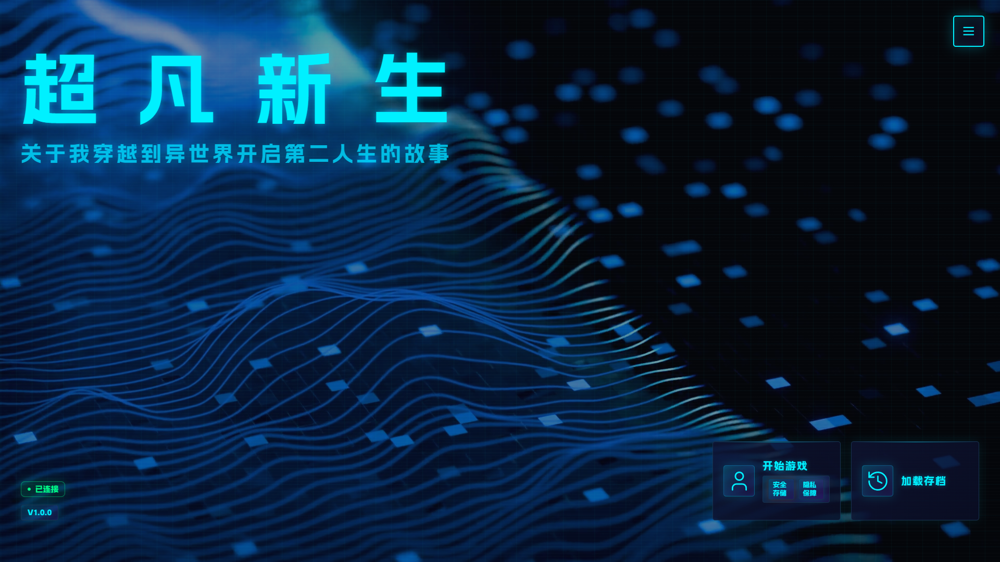

  

<h1 align="center">超凡新生（Transcendent Rebirth）</h1>

  <strong>一个 AI 驱动的沉浸式修仙文字冒险项目。</strong>

  <a href="#项目结构">介绍</a> •
  <a href="#二次开发指引">二次开发指引</a> •

  
  
  
  

  
  
  

  
  
  

---

# 超凡新生（Transcendent Rebirth）

一个 AI 驱动的沉浸式修仙文字冒险项目。前端采用 Vue 3 + TypeScript，后端采用 FastAPI + Tortoise ORM。支持本地存档、提示词管理、管理员后台等能力。

## 项目结构
- 前端：根目录（Vue3 + Webpack）
- 后端：server/（FastAPI）
- 管理后台：server/templates/admin.html

## 运行环境
- Node.js 18+（前端构建）
- Python 3.9+（后端服务）
- 操作系统：Linux/Ubuntu 或 Windows

## 快速启动（Ubuntu）

### 1）后端
在项目根目录执行：
- 启动脚本：server/start.sh
  - 自动创建 venv
  - 安装依赖
  - 生成 .env
  - 启动服务（默认端口 12345）

后端地址：
- API 文档：http://<host>:12345/docs
- 管理后台：http://<host>:12345/admin

### 2）前端
在项目根目录执行：
- 启动脚本：start_frontend.sh
  - 安装依赖
  - 构建 dist
  - 启动静态服务（默认端口 8080）

前端地址：
- http://<host>:8080

> 如需修改端口：
> - 后端：设置环境变量 PORT，例如 PORT=12345
> - 前端：设置环境变量 PORT，例如 PORT=8080

## 二次开发指引

### 前端开发
常用命令（根目录）：
- 安装依赖：npm install
- 开发模式：npm run serve
- 构建生产：npm run build

构建产物在 dist/ 目录。

### 后端开发
常用命令（server 目录）：
- 创建虚拟环境：python3 -m venv venv
- 进入虚拟环境：source venv/bin/activate
- 安装依赖：pip install -r requirements.txt
- 启动服务：python -m uvicorn server.main:app --host 0.0.0.0 --port 12345

### 数据库
使用 Tortoise ORM，启动时会自动创建表结构（generate_schemas）。
生产环境建议使用独立数据库并设置 DATABASE_URL。

### 环境变量
后端配置文件：server/.env（不存在会从 .env.example 复制）。
需要自定义时请修改 .env。

## 部署建议（生产）
- 前端使用 Nginx 反代 dist 目录
- 后端使用 systemd + uvicorn / gunicorn 管理进程
- 配置 HTTPS 与反向代理路径

## 常见问题
- 后端无法访问：检查 .env 中的 DATABASE_URL、端口是否被占用
- 前端无法请求后端：检查 BACKEND_BASE_URL（webpack 定义）或后端地址是否可达

---
本项目基于 [qianye60](https://github.com/qianye60/) 获得授权后大量修改，使用GPL3二次开源

